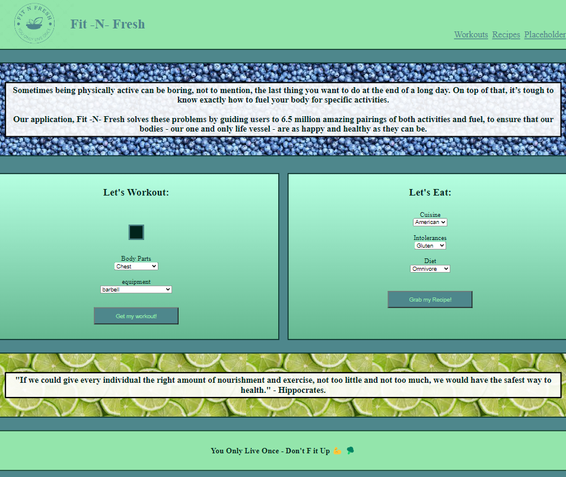

# Fit -N- Fresh

## Description

Sometimes being physically active can be boring, not to mention, the last thing you want to do at the end of a long day. On top of that, it’s tough to know exactly how to fuel your body for specific activities.

Our application, Fit -N- Fresh solves these problems by guiding users to 6.5 million amazing pairings of both activities and fuel, to ensure that our bodies - our one and only life vessel - are as happy and healthy as they can be.

## Installation

N/A

## Usage

The access Fit -N- Fresh, head to the following URL: https://james661.github.io/Fitness-and-nutrition/

To use this webpage, you can select what body part you would like to work out, what type of equipment you have available, and then click on "Get my workout" to be presented with a name gif of your workout.

To select your recipe, choose your cuisine type, followed by any intolerances and diet preferences. Click "Grab my recipe" to be given a card with a recipe photo, ingredients and instructions. 

Enjoy your workout and your recipe - remember we only have 1 life vessel, lets take care of it! 

## Credits

N/A

## License

Please refer to the LICENSE in the repo.
